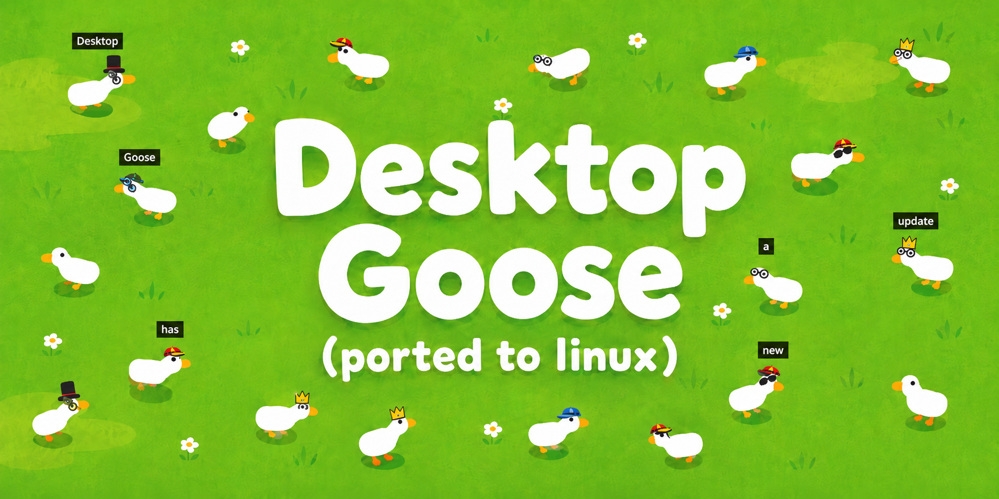
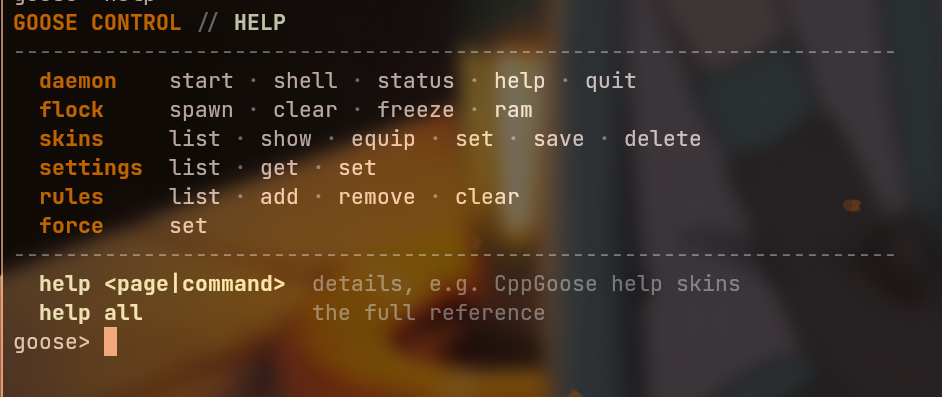
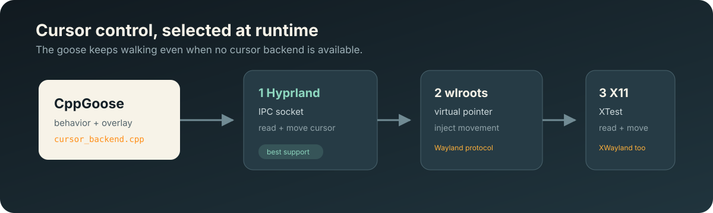
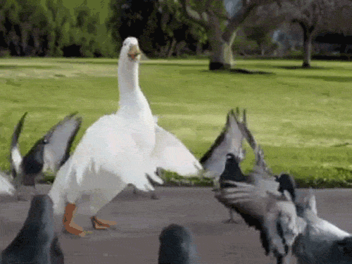

<div align="center">



<br>

[![C++ 17][Badge Cpp]][Build]
[![Wayland and X11][Badge Platforms]][Backends]
[![GitHub issues][Badge Issues]][Issues]
[![GitHub pull requests][Badge Pull Requests]][Pull Requests]
[![Last commit][Badge Last Commit]][Commits]

<br>

A Linux port of Desktop Goose with transparent overlays, multiple geese, cursor
chasing, cosmetics, Perlin-generated personalities, and an interactive terminal.

<br>

---

**[<kbd> <br> Install <br> </kbd>][Build]**  **[<kbd> <br> Quick start <br> </kbd>][Quick Start]**  **[<kbd> <br> Commands <br> </kbd>][Commands]**  **[<kbd> <br> Configure <br> </kbd>][Configure]**  **[<kbd> <br> Architecture <br> </kbd>][Architecture]**  **[<kbd> <br> Contribute <br> </kbd>][Contribute]**

---

<sub>Version 0.31</sub>

</div>

## Features

- Transparent, click-through desktop overlays on every detected monitor
- Multiple independently animated geese with names, skins, and behavior cycles
- Cursor movement across Hyprland, niri, wlroots (sway/river/wayfire), and X11 backends (cursor chase/snatch where the compositor reports pointer position)
- Hyprland window dragging and yeeting with screenshot capture and tiled-window restoration
- Meme fetching, notepad messages, honks, fading footprints, hats, and glasses
- Unique Perlin-generated personality traits for every spawned goose
- Interactive shell with history, inline hints, TAB completion, and compact help pages
- Runtime commands for forcing behavior, scheduling rules, changing settings, and inspecting memory
- Persistent configuration and saved cosmetic profiles in standard XDG directories

## Preview

<div align="center">



<sub>The interactive shell keeps every command visible without filling the terminal.</sub>

</div>

## Install

CppGoose requires CMake 3.17 or newer, a C++17 compiler, `pkg-config`, GTK4,
`gtk4-layer-shell`, SDL2, SDL2_mixer, GDK Pixbuf, Wayland client libraries,
X11, and XTest.

<details>
<summary><b>Arch Linux</b></summary>

```bash
sudo pacman -S cmake ninja gtk4 gtk4-layer-shell sdl2 sdl2_mixer \
  gdk-pixbuf2 wayland xorg-server-devel libxtst
```

</details>

<details>
<summary><b>Fedora</b></summary>

```bash
sudo dnf install cmake ninja-build gtk4-devel gtk4-layer-shell-devel \
  SDL2-devel SDL2_mixer-devel gdk-pixbuf2-devel wayland-devel \
  libX11-devel libXtst-devel
```

</details>

<details>
<summary><b>Ubuntu 24.04 or newer</b></summary>

```bash
sudo apt install cmake ninja-build libgtk-4-dev libgtk4-layer-shell-dev \
  libsdl2-dev libsdl2-mixer-dev libgdk-pixbuf-2.0-dev libwayland-dev \
  libx11-dev libxtst-dev
```

If your package repository does not provide `gtk4-layer-shell`, build it from
[wmww/gtk4-layer-shell](https://github.com/wmww/gtk4-layer-shell).

</details>

Clone, build, and install system-wide:

```bash
git clone https://github.com/jeffthepineapple/desktop-goose-linux-port.git
cd desktop-goose-linux-port
cmake -S . -B build -G Ninja -DCMAKE_BUILD_TYPE=Release -DBUILD_TESTING=ON
cmake --build build
sudo cmake --install build
```

The default prefix installs the executable to `/usr/local/bin/CppGoose` and the
runtime assets to `/usr/local/share/CppGoose/Assets`. After source changes,
rebuild and reinstall:

```bash
cmake --build build
sudo cmake --install build
```

Run the contracts with:

```bash
ctest --test-dir build --output-on-failure
```

CMake regenerates the Wayland protocol bindings with `wayland-scanner`: virtual
pointer input, screencopy capture, and Hyprland toplevel export. The generated
files stay in the build directory.

### Nix

With flakes enabled, run directly from the repository:

```bash
nix run .
```

Build the package without running it:

```bash
nix build .
```

The flake also provides a development shell:

```bash
nix develop
```


## Quick start

The installed command works from any directory:

```bash
CppGoose spawn "Pip"  # start the daemon with one named goose
CppGoose spawn Sam     # add another goose when the daemon is running
CppGoose status        # inspect the flock
CppGoose shell         # open the interactive terminal
CppGoose quit          # remove the geese and stop the daemon
```

Running `CppGoose` starts the daemon when it is stopped. If the daemon is already
running, the same command opens the shell.

For foreground logs during development:

```bash
CppGoose spawn "Pip" --foreground
```

## Command reference

`CppGoose help` prints a compact index. `CppGoose help <page-or-command>` opens
one section, while `CppGoose help all` prints the full reference.

### Daemon and flock

| Command | Purpose |
|---|---|
| `CppGoose spawn [name] [--foreground]` | Start the daemon with the first goose, or add a goose |
| `CppGoose shell` | Open the interactive shell |
| `CppGoose status` | Show geese, state, traits, files, and runtime settings |
| `CppGoose clear` | Remove every goose without stopping the daemon |
| `CppGoose freeze [on\|off\|toggle]` | Pause or resume all behavior updates |
| `CppGoose ram` | Show current, peak, and virtual memory use |
| `CppGoose quit` | Remove every goose and stop the daemon |
| `CppGoose help [page\|command\|all]` | Open compact or detailed help |

### Cosmetics

| Command | Purpose |
|---|---|
| `CppGoose skins [list]` | List hats, glasses, built-in looks, and saved looks |
| `CppGoose skins show <id>` | Inspect one goose's outfit |
| `CppGoose skins equip <id> <look>` | Equip a built-in or saved look |
| `CppGoose skins set <id> <hat\|glasses> <item\|none>` | Change one cosmetic slot |
| `CppGoose skins save <id> <look>` | Save the current outfit |
| `CppGoose skins delete <look>` | Delete a saved look |

Built-in looks are `classic`, `scholar`, `party`, `pilot`, `royal`, and
`incognito`. Saved looks live in the standard XDG config directory.

### Settings and behavior

| Command | Purpose |
|---|---|
| `CppGoose settings [list]` | List every configurable value |
| `CppGoose settings get <key>` | Read one value |
| `CppGoose settings set <key> <value>` | Change and persist one value |
| `CppGoose force set <id> <wander\|chase\|drag\|yeet\|meme [path]\|note [path]\|note text <text>>` | Interrupt one goose or start a window interaction |
| `CppGoose rules [list]` | List active rules |
| `CppGoose rules add <id\|all> <action> [interval] [text]` | Schedule a behavior (`wander`, `meme`, `note`, `text`, `chase`, `drag`, or `yeet`) |
| `CppGoose rules remove <rule-id>` | Remove one rule |
| `CppGoose rules clear` | Remove every rule |

Rule actions are `wander`, `meme`, `note`, `text`, `chase`, `drag`, and `yeet`.
An omitted interval creates a one-shot rule. For `text`, words after the
optional interval become the note message.

On Hyprland, `drag` carries a captured edge window behind the goose and
restores it at the carried image's final position. `yeet` throws the captured
window image with gravity and bounces before restoring the real window. Both
behaviors preserve the original tiled or floating mode when possible.

Force a specific goose to fetch an image, a note file, or inline note text:

```bash
CppGoose force set 0 meme /absolute/path/to/image.png
CppGoose force set 0 note /absolute/path/to/note.txt
CppGoose force set 0 note text 'First line\nSecond line'
```

Use an absolute path when the CLI and daemon were started from different
directories. In inline text, `\n` starts a new line. Quote paths or text that
contain spaces. `meme file <path>` and `note file <path>` are accepted aliases.

### Interactive shell

The shell keeps up to 500 history entries in the standard XDG state directory.
TAB completes commands, subcommands, setting keys, goose IDs, skin names,
cosmetic items, rule IDs, force behaviors, and `file`/`text` force sources.
Inline hints show the remaining arguments without filling the screen.

```text
goose> skins equip 1 pa<TAB>
goose> force set 1 chase
goose> help rules
goose> exit
```

`exit` leaves the shell while the daemon keeps running. `quit` asks for
confirmation and stops the daemon. `cls` clears the terminal.

## Goose personalities

Every spawn samples a profile from a randomly seeded 2D Perlin noise field. The
profile changes three probabilities already used by the behavior cycle:

| Trait | Range | Effect |
|---|---:|---|
| Attack | `0..50` | Added to the cursor chase chance |
| Meme | `0..60` | Increases the chance of fetching a meme |
| Note | `0..40` | Increases the chance of fetching a text note |

The generator assigns a unique 64-bit seed and reserves each integer trait
combination, preventing duplicate profiles until every possible combination has
been used. Global settings still apply.

`CppGoose status` shows the live profile:

```text
goose.1.trait_seed=17292038531351920897
goose.1.trait_attack=22
goose.1.trait_meme=34
goose.1.trait_note=16
```

## Configuration

Settings are stored under `$XDG_CONFIG_HOME/desktop-goose`, falling back to
`$HOME/.config/desktop-goose`. A working-directory `config.ini` is still read as
a migration fallback.

| Key | Default | Meaning |
|---|---:|---|
| `global_scale` | `1.0` | Goose and dropped-item render scale |
| `walk_speed` | `180` | Base walking speed in pixels |
| `run_speed` | `480` | Base chase speed in pixels |
| `memes_enabled` | `1` | Allow meme and note fetching |
| `multi_monitor_enabled` | `1` | Let geese roam across monitors |
| `audio_enabled` | `1` | Play honks and behavior sounds |
| `cursor_chase_enabled` | `1` | Allow cursor chase behavior |
| `cursor_chase_chance` | `3` | Base cursor chase percentage |
| `snatch_duration` | `3.0` | Cursor hold duration in seconds |
| `mud_enabled` | `1` | Enable footprint trails |
| `mud_chance` | `15` | Footprint chance percentage |
| `mud_lifetime` | `15.0` | Footprint lifetime in seconds |
| `debug_visuals` | `0` | Draw state and physics overlays |
| `debug_terminal` | `0` | Write runtime debugging to the terminal |

Changes made through `settings set` take effect immediately and persist to disk.

```bash
CppGoose settings
CppGoose settings get walk_speed
CppGoose settings set walk_speed 220
```

## Cursor backends

<div align="center">



</div>

CppGoose tries cursor backends in this order:

1. **Hyprland IPC** uses `HYPRLAND_INSTANCE_SIGNATURE` to find the compositor
   socket. It can read and move the cursor, and enumerate windows/monitors.
2. **niri IPC + virtual pointer** detects niri via `$NIRI_SOCKET`. It moves the
   cursor through `zwlr_virtual_pointer_manager_v1` and reads window/monitor
   geometry over niri's line-delimited JSON IPC (`Outputs`, `Workspaces`,
   `Windows`).
3. **wlroots virtual pointer** uses
   `zwlr_virtual_pointer_manager_v1` to inject pointer motion on other
   compatible Wayland compositors (sway, river, wayfire, ...).
4. **X11/XTest** uses `XQueryPointer` and `XTestFakeMotionEvent` on X11 and
   mixed XWayland sessions.

The overlay and non-cursor behavior still work when no backend initializes. Only
one goose can control the cursor at a time.

### Display support

- Hyprland has the fullest support: cursor read/move plus IPC-driven window
  edge detection and the screenshot-carry window drag.
- niri renders the goose (layer-shell), moves the cursor (virtual pointer), and
  feeds window edge detection from its IPC. It exposes no pointer position over
  IPC, so cursor chase/snatch is unavailable; the screenshot-carry window drag
  is Hyprland-only (it depends on `hyprland-toplevel-export`, which niri lacks).
- Sway, river, wayfire, and other wlroots compositors get overlay rendering and
  virtual-pointer cursor movement via the generic wlroots backend.
- KDE Plasma 6 supports layer-shell overlays, but cursor injection depends on
  compositor protocol support.
- Stock GNOME/Mutter does not expose `wlr-layer-shell-unstable-v1`.
- Native X11 and XWayland use XTest when available.

## Architecture

```text
main.cpp
  CLI entry, daemon lifecycle, GTK application
       |
       +-- command_socket.cpp <----> cli_shell.cpp / cli_visuals.cpp
       |           |
       |           +--> app_actions.cpp
       |                    |
       |                    +--> world.cpp, goose.cpp, cosmetics.cpp
       |
       +-- ui.cpp
             |
             +--> overlay rendering and 60 Hz behavior tick
             +--> cursor_backend.cpp
                     +--> hyprland.cpp    (Hyprland IPC)
                     +--> niri.cpp        (niri IPC + virtual pointer)
                     +--> wlroots_backend.cpp
                     +--> x11_backend.cpp
```

Important files:

| Path | Responsibility |
|---|---|
| `main.cpp` | CLI entry, daemon launch, GTK lifecycle |
| `src/goose.cpp` | Movement, rendering, state transitions, forced behavior |
| `src/goose_traits.cpp` | Seeded Perlin map and unique personality profiles |
| `src/ui.cpp` | Overlay windows, drawing, and frame tick |
| `src/world.cpp` | Shared geese, items, monitors, rules, and cursor ownership |
| `src/app_actions.cpp` | Runtime command handlers |
| `src/cli_registry.cpp` | Single command metadata source for help and completion |
| `src/cli_shell.cpp` | Interactive input, history, hints, and dynamic completion |
| `src/command_socket.cpp` | Unix socket transport between CLI and daemon |
| `src/cosmetics.cpp` | Cosmetic catalog, profiles, and Cairo drawing |
| `src/config.cpp` | Persistent typed configuration registry |
| `src/cursor_backend.cpp` | Runtime cursor backend selection |
| `src/hyprland.cpp` | Hyprland IPC: cursor, windows, monitors, window drag |
| `src/niri.cpp` | niri IPC window/monitor awareness + virtual-pointer cursor |
| `src/edge_detector.cpp` | Backend-agnostic window edge detection |

### Behavior state machine

| State | Meaning |
|---|---|
| `WANDER` | Walk toward changing targets and choose the next behavior |
| `FETCHING` | Move off-screen to collect a meme or note |
| `RETURNING` | Carry an item back to a drop point |
| `CHASE_CURSOR` | Follow the live cursor target |
| `SNATCH_CURSOR` | Hold and move the cursor for a short period |
| `DRAG_WINDOW` | Capture, carry or yeet a Hyprland edge window, then restore it |
`force set` safely cancels the current held item or cursor grab before entering a
new behavior. Rules use the same force helpers from the regular frame tick.

## Assets

| Directory | Contents |
|---|---|
| `Assets/Images/Memes/` | PNG and GIF files geese can fetch and drop |
| `Assets/Text/NotepadMessages/` | Plain-text notes geese can carry |
| `Assets/Sound/NotEmbedded/` | Honks, footsteps, bites, and mud sounds |
| `Assets/Sound/Music/` | Optional music asset |

The image loader scans the meme directory at startup. SDL2_mixer loads supported
WAV, OGG, and MP3 files. See
[`Assets/Images/MemeAttributions.txt`](./Assets/Images/MemeAttributions.txt) for
known image sources.

<details>
<summary><b>Show one bundled meme asset</b></summary>

<div align="center">

</div>

</details>

## Known limitations

- GNOME/Mutter needs a third-party layer-shell extension before the overlay can
  appear.
- Fractional scaling and mixed-DPI layouts can cause small position differences
  near monitor boundaries.
- Window drag and yeet require Hyprland IPC plus the compositor's supported
  screencopy and toplevel-export protocols.
- The wlroots virtual-pointer protocol can inject movement but cannot always
  provide an absolute cursor position.
- Geese draw over windows but do not inspect or understand window contents.

## Contributing

1. Keep behavior and services in focused source files. `src/ui.cpp` should remain
   the rendering and frame-loop coordinator.
2. Put shared runtime state in `src/world.cpp` rather than adding unrelated
   translation-unit globals.
3. Build both the application and tests before opening a pull request:

```bash
cmake --build build
ctest --test-dir build --output-on-failure
```

Use [GitHub Issues][Issues] for bugs and [Pull Requests] for code changes.

## Licensing and attribution

This repository does not currently include a project-level license file. Add one
before distributing modified builds. Bundled third-party media may have separate
terms; review `Assets/Images/MemeAttributions.txt` and the source of each asset.
The vendored linenoise library includes its own BSD license in
`third_party/linenoise/LICENSE`.

<!----------------------------------------------------------------------------->

[Build]: #install
[Quick Start]: #quick-start
[Commands]: #command-reference
[Configure]: #configuration
[Architecture]: #architecture
[Backends]: #cursor-backends
[Contribute]: #contributing

[Issues]: https://github.com/jeffthepineapple/desktop-goose-linux-port/issues
[Pull Requests]: https://github.com/jeffthepineapple/desktop-goose-linux-port/pulls
[Commits]: https://github.com/jeffthepineapple/desktop-goose-linux-port/commits/main

[Badge Cpp]: https://img.shields.io/badge/C%2B%2B-17-00599C?logo=cplusplus&logoColor=white
[Badge Platforms]: https://img.shields.io/badge/display-Wayland%20%7C%20X11-8dd7bf
[Badge Issues]: https://img.shields.io/github/issues/jeffthepineapple/desktop-goose-linux-port
[Badge Pull Requests]: https://img.shields.io/github/issues-pr/jeffthepineapple/desktop-goose-linux-port
[Badge Last Commit]: https://img.shields.io/github/last-commit/jeffthepineapple/desktop-goose-linux-port
